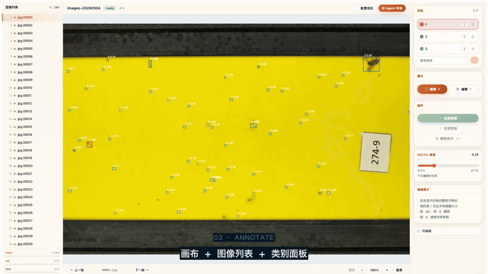
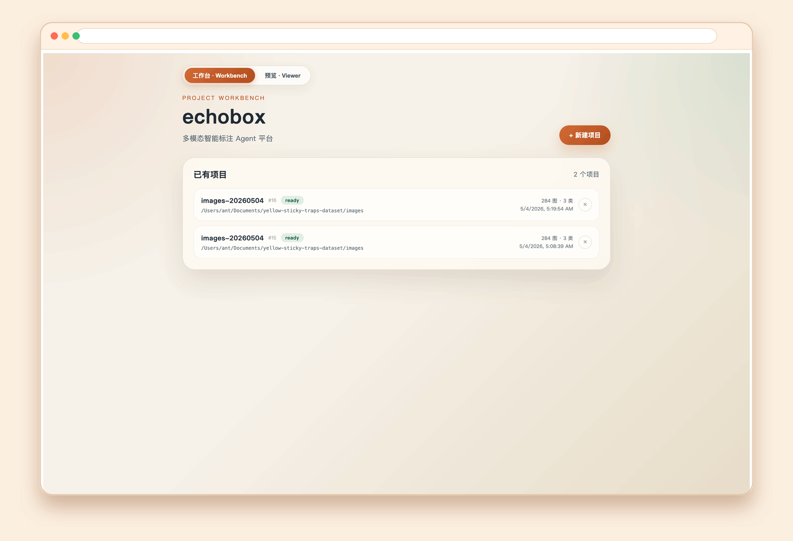
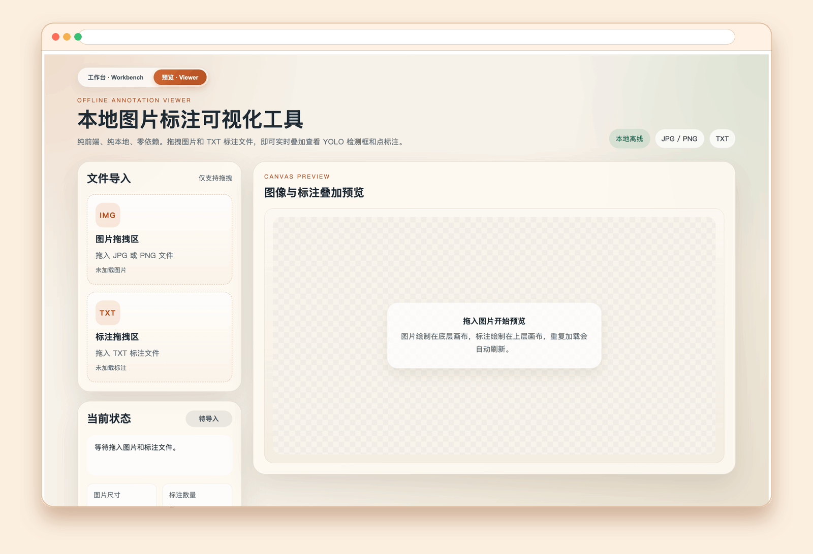
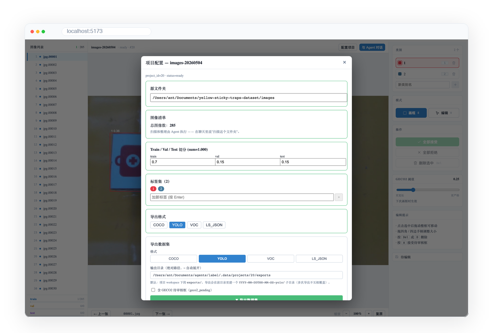
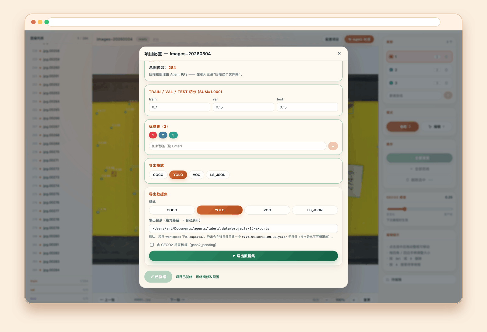
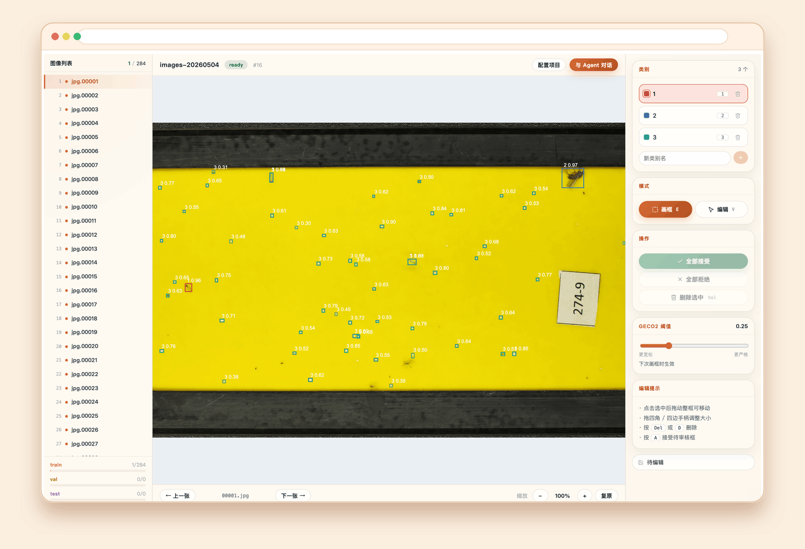
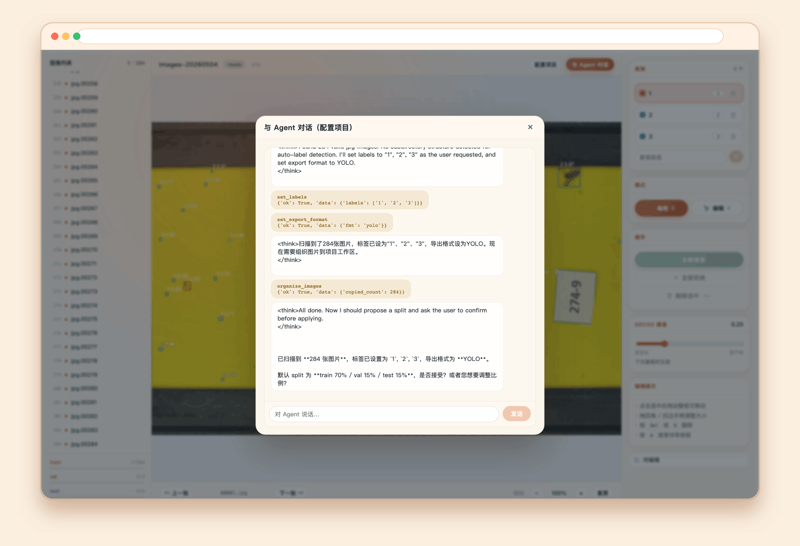

<p align="center">
  
</p>

<p align="center">
  <a href="LICENSE"></a>
  <a href="https://github.com/AntColony10086/echobox/stargazers"></a>
</p>

<p align="center"><b>One box → all the boxes.</b> · <b>画一框，框出全图。</b></p>

<p align="center">
  <video src="https://github.com/AntColony10086/echobox/raw/main/assets/promo/echobox-promo.mp4" controls muted playsinline width="900"></video>
</p>

<p align="center">
  <sub>
    50 秒看完 · 50-second tour ·
    <a href="assets/promo/echobox-promo.mp4">download MP4</a> ·
    <a href="assets/promo/echobox-promo-bgm-only.mp4">no-voice version</a>
  </sub>
</p>

<p align="center">
  
</p>

---

## What it does · 核心能力

**EN.** Echobox is a multimodal annotation agent with two workspaces in one app:
the **Workbench** for full agent-driven annotation, and the **Viewer** for a zero-dependency
offline preview of YOLO / point annotations. In the Workbench, you draw one bounding box
and an LLM-supervised exemplar detector ([GECO2](https://github.com/jerpelhan/GECO2),
backed by Meta's [SAM2](https://github.com/facebookresearch/sam2)) returns every similar
object in the image. You adjust, accept, save. A LangGraph agent handles the boring parts —
folder scanning, train/val/test split, label suggestions, and dataset export to COCO / YOLO /
Pascal VOC / Label Studio JSON. The same tools are exposed as MCP, so other agents
(Claude Code, Cursor, …) can drive annotation programmatically.

**中文.** Echobox 是一个多模态智能标注 Agent，一个 app 里两套工作区：
**工作台** 走 Agent 全流程标注，**预览** 是零依赖的离线 YOLO / 点标注预览器。
工作台里你只需画一个 bbox，LLM 监督下的 exemplar 检测器
（[GECO2](https://github.com/jerpelhan/GECO2)，底层用 Meta 的
[SAM2](https://github.com/facebookresearch/sam2)）就把图里所有相似目标都框出来。
你确认、调整、保存。LangGraph agent 负责扫描文件夹、切分 train/val/test、推荐标签、导出
COCO / YOLO / Pascal VOC / Label Studio JSON。同一套工具暴露为 MCP，其它 agent
（Claude Code、Cursor 等）也可以编程方式调用。

## Architecture · 架构

4 processes, all run locally — no Docker required. · 4 个进程纯本地运行，不需要 Docker。

```
Browser ──▶ frontend (Vite, port 5173)
                │
                ▼
          app (FastAPI, port 8000) ──▶ ml_backend (FastAPI + GPU, port 9090)
                │                              │
                │                              └─▶ GECO2 / SAM2 inference
                │
                ├─▶ OpenAI-compatible LLM (DashScope / MiniMax / OpenAI / …)
                └─▶ SQLite + filesystem workspace

mcp_server (stdio) ──▶ app HTTP — for Claude Code / Cursor consumers
```

## Quick start · 快速开始

```bash
# 1. Clone (with GECO2 submodule)
git clone --recurse-submodules https://github.com/AntColony10086/echobox
cd echobox

# 2. Configure your LLM (any OpenAI-compatible)
cp .env.example .env
# Edit .env — set ECHOBOX_APP_LLM_API_KEY, _BASE_URL, _MODEL

# 3. Install (uv handles Python; npm handles JS)
make setup

# 4. Get GECO2 weights
mkdir -p .data/weights
curl -L https://github.com/jerpelhan/GECO2/releases/download/v1.0/CNTQG_multitrain_ca44.pth \
  -o .data/weights/CNTQG_multitrain_ca44.pth

# 5. Initialize the database
make db-upgrade

# 6. Start everything (4 processes via honcho) and open the browser
make dev
# open http://localhost:5173
```

> **EN.** Need help on step 4? See [GECO2 releases](https://github.com/jerpelhan/GECO2/releases) for the latest weight URL and SHA256.
>
> **中文.** 第 4 步遇到问题，去 [GECO2 releases](https://github.com/jerpelhan/GECO2/releases) 查最新权重链接和 SHA256。

## Screenshots · 界面预览

<table align="center">
  <tr>
    <th align="center">Workbench · 工作台</th>
    <th align="center">Viewer · 预览</th>
  </tr>
  <tr>
    <td align="center"></td>
    <td align="center"></td>
  </tr>
  <tr>
    <th align="center">Setup · 配置</th>
    <th align="center">Export · 导出</th>
  </tr>
  <tr>
    <td align="center"></td>
    <td align="center"></td>
  </tr>
  <tr>
    <th align="center">Annotate · 标注</th>
    <th align="center">Chat · 对话</th>
  </tr>
  <tr>
    <td align="center"></td>
    <td align="center"></td>
  </tr>
</table>

## MCP integration · MCP 集成

**EN.** Add this to your Claude Code / Cursor MCP config to call echobox tools from another agent:

```json
{
  "mcpServers": {
    "echobox": {
      "command": "uv",
      "args": ["run", "--package", "echobox-mcp", "echobox-mcp"],
      "cwd": "/path/to/echobox",
      "env": {
        "ECHOBOX_MCP_APP_URL": "http://localhost:8000"
      }
    }
  }
}
```

Available tools: `start_annotation_project`, `search_annotations`, `export_dataset`, plus all setup tools.

**中文.** 添加上面 JSON 到你的 Claude Code / Cursor MCP 配置即可让其它 agent 调用 echobox 工具。
工具清单：`start_annotation_project`、`search_annotations`、`export_dataset`，以及全部 setup 工具。

## How GECO2 works · GECO2 原理

**EN.** GECO2 (Generalist Exemplar-based COunting and detection) takes one user-drawn
exemplar and uses SAM2's image embedding to find every similar object. We use it as a
detector (not a counter): the predicted heatmap is binarised and converted to bboxes.
[Paper · jerpelhan/GECO2](https://github.com/jerpelhan/GECO2)

**中文.** GECO2 用一个用户画的 exemplar，借助 SAM2 的 image embedding，找出所有相似目标。
我们把它当作检测器用（不是计数器）：把预测的热力图二值化转成 bbox。
[论文 · jerpelhan/GECO2](https://github.com/jerpelhan/GECO2)

## Project layout · 工程结构

```
echobox/
├─ packages/
│  ├─ app/          (FastAPI + LangGraph agent + REST API)
│  ├─ ml_backend/   (FastAPI + GECO2/SAM2 inference)
│  └─ mcp_server/   (MCP stdio server, calls app HTTP)
├─ frontend/        (React + Vite + react-konva)
├─ docs/            (architecture, API, dev, extending)
├─ assets/          (logo, screenshots, social card)
├─ Procfile         (honcho config: 4 processes)
├─ Makefile         (dev shortcuts)
└─ .env.example
```

## Acknowledgements · 致谢

Echobox stands on the shoulders of these projects — credit and copyright belong to their
authors. · Echobox 完全基于以下项目，版权与归属归原作者所有：

- **GECO2** — [jerpelhan/GECO2](https://github.com/jerpelhan/GECO2) — exemplar-based detector
- **SAM2** — [facebookresearch/sam2](https://github.com/facebookresearch/sam2) — Meta AI
- **Deformable-DETR** — [fundamentalvision/Deformable-DETR](https://github.com/fundamentalvision/Deformable-DETR)
- **LangGraph** — [langchain-ai/langgraph](https://github.com/langchain-ai/langgraph)
- **FastAPI** — [tiangolo/fastapi](https://github.com/tiangolo/fastapi)

See [`NOTICE`](NOTICE) for the full attribution list.

## License · 许可

Apache-2.0 — see [`LICENSE`](LICENSE) and [`NOTICE`](NOTICE).

## Contributing · 参与开发

PRs welcome — see [`CONTRIBUTING.md`](CONTRIBUTING.md). · PR 欢迎，详见 [`CONTRIBUTING.md`](CONTRIBUTING.md)。

## Citation

If echobox helps your research, a citation is appreciated:

```bibtex
@software{echobox2026,
  title  = {echobox: Multimodal annotation agent with exemplar-based detection},
  author = {The echobox contributors},
  year   = {2026},
  url    = {https://github.com/AntColony10086/echobox}
}
```

---

## 视频简介 · Video Pitch

> **echobox** 是一个开源（Apache-2.0）的 AI 图像标注工作台，把"画一个框 → AI 自动框出图里所有相似目标"做成完整工作流。
>
> *echobox is an open-source (Apache-2.0) AI image-labeling workspace that turns "draw one box → auto-detect every similar object" into an end-to-end flow.*

50 秒视频 · [`assets/promo/echobox-promo.mp4`](assets/promo/echobox-promo.mp4) 带你看完核心能力：

- 🎯 **一框出全图** — 你画一个 bbox，GECO2 + Meta SAM2 把图里所有相似目标自动框出来
- 🖼️ **标注工作台** — 画布 / 图像列表 / 类别面板一站式
- 💬 **Agent 对话** — 自然语言驱动整个流程（扫描文件夹、切分 train/val/test、推荐标签）
- 📤 **多格式导出** — YOLO / COCO / Pascal VOC / Label Studio JSON
- 👀 **离线预览** — 拖入图片 + YOLO 标注立即可视化，零依赖
- 🔌 **MCP 集成** — Claude Code / Cursor 等 Agent 可以直接调用同一套工具

### ⚠️ 项目目前刚刚起步 · This is an early-stage project

这是 v0.1.0 的早期版本，意味着：

- 一部分功能还在打磨（分割任务、视频帧标注、多人协作等）
- 文档、示例、测试都还不够丰富
- 一些边界场景可能会有 bug
- 部分 UI 细节、键盘快捷键还没补全

我相信"一个人能做出原型，但好工具一定是大家一起做出来的"。
*One person can ship a prototype; great tools take a community.*

**如果你也在做图像标注相关的工作，或者对 AI Agent + 数据工程感兴趣，非常欢迎你参与进来：**

- 🐛 **遇到 bug** — 直接提 [Issue](https://github.com/AntColony10086/echobox/issues)，附上复现步骤即可
- 💡 **觉得哪里可以更好用** — 提 Feature Request 或者直接发 PR
- 📝 **用过其它标注平台** — 把对比体验告诉我，让我们少走弯路
- 🌱 **新人想练手** — 文档完善、翻译、写测试、出教程都是非常好的切入点
- ⭐ **暂时没时间贡献代码** — 给个 Star 也是很大的鼓励，能让更多人看到这个项目

让我们一起把它做成中文社区里最好用的开源标注工具。
*Let's make this the friendliest open-source image-labeling tool out there — together.*

### 一句话版本 · TL;DR

刚开源了一个 AI 图像标注工具：画一个框 → AI 自动框出图里所有相似目标。支持 YOLO / COCO / VOC 多格式导出，可以用自然语言和 Agent 对话来管理整个流程。

项目刚起步，欢迎大家一起来完善——提 Issue、发 PR、给个 Star 都是巨大的鼓励 🙏

`#开源` `#图像标注` `#AI` `#ComputerVision` `#YOLO` `#SAM2` `#LangGraph` `#FastAPI` `#React` `#LLM` `#Agent`
